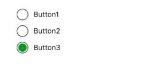
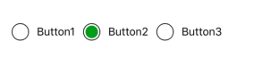
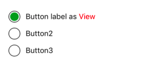
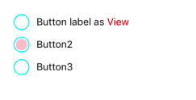

# react-native-radio-button-group

> Simple and handy animated Radio group button for React Native in Android and IOS

[]()[]()

[](https://nodei.co/npm/react-native-radio-button-group/)

Demo
---


.


## Installation

in Cli

```sh
npm i react-native-radio-button-group --save

            OR

yarn add react-native-radio-button-group
```


# Getting started

```js
import RadioGroup from 'react-native-radio-button-group';


var radiogroup_options = [
  {id: 0, label: 'Button1' },
  {id: 1, label: 'Button2' },
  {id: 2, label: 'Button3' },
  {id: 3, label: 'Button4' },
];

var RadioGroupProject = React.createClass({
  getInitialState: function() {
    return {
        selectedOption: null,
    }
  },
  render: function() {
    return (
      <View>
            <RadioGroup
                  options={radiogroup_options}
                  onChange={(option) => this.setState({selectedOption: option})}
            />
      </View>
    );
  }
});
```


### Props
Key | Type | Default | Value
--- | --- | --- | ---
options | Array | [ ] | [Option](https://github.com/Abilashinamdar/react-native-radio-button-group#option)
horizontal | Boolean | false | true / false
activeButtonId | String / Number | _ | option id from the given options array
onChange | function | _ | callback function
circleStyle| Object | [CircleStyle](https://github.com/Abilashinamdar/react-native-radio-button-group#circlestyle)| [CircleStyle](https://github.com/Abilashinamdar/react-native-radio-button-group#circlestyle) with even more properties as required.

#### Option
```
{
    id: number | string,
    label: string,
    labelView: Element
}
```

#### CircleStyle
```
{
    width: 22,
    height: 22,
    borderColor: '#000',
    borderWidth: 0.8,
    marginRight: 10,
    fillColor: '#279315'
}

Note : 'fillColor' used to change the background color of the circle on select.
```

### Usage
##### horizontal

```js
<RadioGroup
      horizontal
      options={radiogroup_options}
/>
```


##### label as view

```js
<RadioGroup
      options={[
        {
              id: 0,
              labelView: (
                <Text style={{flex: 1}}>
                  Button label as <Text style={{ color: 'red' }}>View</Text>
                </Text>
              ),
        },
        { id: 1, label: 'Button2' },
        { id: 2, label: 'Button3' },
      ]}
      activeButtonId={0}
/>
```

##### customized button

```js
<RadioGroup
      horizontal
      options={[
        {
              id: 0,
              labelView: (
                <Text>
                  Button label as <Text style={{ color: 'red' }}>View</Text>
                </Text>
              ),
        },
        { id: 1, label: 'Button2' },
        { id: 2, label: 'Button3' },
      ]}
      activeButtonId={0}
      circleStyle={{ fillColor: 'pink', borderColor: 'cyan' }}
/>
```


# License
MIT
